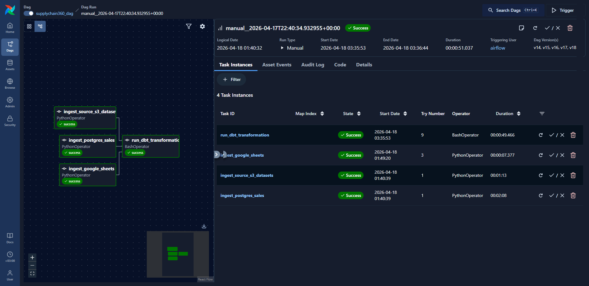

# SupplyChain360: End-to-End Unified Data Platform

## Navigation

 - Overview

 - Project Architecture
 
 - Data Sources
 
 - [The Medallion Pipeline (dbt)]
 
 - Infrastructure & DevOps
 
 - How to Reproduce
 
 - Business Insights

## Overview
SupplyChain360 is a unified supply chain analytics project built to solve key operational inefficiencies within a large retail distribution network in the United States. The company manages product movement across multiple warehouses, suppliers, and retail stores, but critical data is currently fragmented across separate systems, leading to delayed reporting and limited visibility into day to day operations.

As a result, leadership struggles to answer fundamental questions around inventory performance, supplier reliability, delivery efficiency, and product demand. This project addresses that gap by designing a centralized data platform that integrates operational data into a single source of truth, enabling timely and reliable analytics for better decision making across the supply chain.

## Project Goal
 - Build a unified data platform that consolidates and enable end to end visibility across the supply chain, from supplier delivery to store sales.
 - Identify and analyze drivers of stockouts and overstock situations
 - Monitor and evaluate supplier performance, especially delivery reliability and delays
 - Improve warehouse efficiency by detecting bottlenecks and inefficiencies
 - Automate manual spreadsheet based reporting into scalable data pipelines
 - Provide reliable datasets for demand forecasting and inventory planning use cases
 - Create a scalable foundation that supports future data sources and business growth

## Data Sources
The pipeline ingests data from four distinct environments:

| Source | Domain | Format | Frequency |
| :--- | :--- | :--- | :--- |
| **AWS S3** | Products, Suppliers, Warehouses | CSV | Static / Reference |
| **Google Sheets** | Store Locations | API | Static |
| **AWS S3** | Inventory Snapshots & Shipments | CSV/JSON | Daily Incremental |
| **PostgreSQL** | Store Sales Transactions | DB Tables | Daily (New Table/Day) |

## Project Architecture
The pipeline implements a structured data flow designed for modularity, reliability, and analytical performance. By utilizing a **Staging → Intermediate → Marts architecture** to ensure a clear separation between raw data ingestion and business-ready insights.

### Data Architecture & Flow
The pipeline follows a rigorous lifecycle inside the Snowflake Data Warehouse, managed and transformed via dbt (data build tool):

 - **Landing Zone (S3)**: The entry point for all raw data. Files are ingested from three distinct source systems (PostgreSQL, Google Sheets, and AWS S3) and stored in Parquet format. This zone serves as the immutable "System of Record," partitioned by date to support point-in-time recovery and idempotency.

 - **Staging Layer (`STAGING` Schema):** This is the first layer within the warehouse. Staging models create a 1-to-1 mapping with raw source data. Here, strict schema validation is enforced, renaming columns to a standardized `snake_case` convention, and casting data types (e.g., converting strings to timestamps). The goal is simply to create a clean, queryable version of the raw files.

 - **Intermediate Layer (`INTERMEDIATE` Schema):** This layer handles the "heavy lifting" of the transformation process. Complex business logic including deduplication using ingestion timestamps to ensure only the latest record is processed, handling messy sensor data or NULL values, and performing cross-domain enrichment—such as calculating shipment lead times or mapping products to their respective suppliers.

 - **Marts Layer (`ANALYTICS` Schema):** The final destination for business-ready data, modeled using a Star Schema (`Dimensions` and `Facts`). Data is organized into highly performant tables optimized for analytics. Dimensions (`dim_`) provide the context (Who, What, Where), while Fact tables (`fct_`) store the quantitative supply chain metrics (Stockouts, Sales Volume, Supplier Performance) required for executive decision-making.

## Tech Stack
 - **Orchestration:** Apache Airflow (Dockerized)

 - **Storage (Raw/Landing):** AWS S3 (Parquet format)

 - **Data Warehouse:** Snowflake (Medallion Structure)
 
 - **Transformation:** dbt (Data Build Tool)

 - **Infrastructure:** Terraform (S3, Snowflake, IAM)

 - **CI/CD:** GitHub Actions (Linting & Docker Hub deployment)

## The Medallion Pipeline (dbt)
Used dbt to transform the **Raw (Staging)** data into a cleaned **Silver (Intemediate)** layer and a business-ready **Gold (Marts)** layer. For a more detailed breakdown of the pipeline structure, please [click here](./airflow/include/dbt/supplychain360/readme.md).


### 1. Staging (Raw)
Initial cleaning and standardization of raw source data. Schema evolution handling and Parquet enforcement.

 | Model | Source | Frequency |
| :--- | :--- | :--- |
| `stg_store_locations` | Google Sheets | Static / Ad-hoc |
| `stg_products` | AWS S3 (CSV) | Static / Reference |
| `stg_suppliers` | AWS S3 (CSV) | Static / Reference |
| `stg_warehouses` | AWS S3 (CSV) | Static / Reference |
| `stg_inventory` | AWS S3 (CSV) | Static / Reference |
| `stg_shipments` | AWS S3 (JSON) | Daily Incremental |
| `stg_store_sales` | PostgreSQL | Daily (New Table/Day) 

### 2. Intermediate Layer (`INTERMEDIATE` Schema)
The "heavy lifting" layer where we handle deduplication and enrichment.

 - **Deduplication:** Uses `ingestion_timestamp` to ensure only the latest records flow into the warehouse (e.g., `int_dedup_inventory`).

 Enrichment: Joins sales with product/store metadata (`int_store_sales_enriched`) and calculates logistics KPIs (`int_supplier_delivery_performance`).

### 3. Marts Layer (ANALYTICS Schema)
Final Dimensions (Who/What/Where) and Facts (Metrics) optimized for AI/BI Dashboards.

 - **Facts:** `fct_product_stockouts`, `fct_supplier_performance`, `fct_regional_sales_demand`.

 - **Dimensions:** `dim_dates`, `dim_products`, `dim_stores`, `dim_suppliers`, `dim_warehouses`.

## Workflow Orchestration
I made use of Apache Airflow to coordinate the end-to-end data lifecycle. The master DAG handles:

 **1. Extract:** Pulling daily sales from Postgres and inventory from S3.

 **2. Load:** Moving raw files into Snowflake landing tables.
 
 **3. Transform:** Triggering `dbt run` and `dbt test` to refresh the Marts.

 **4. Quality Check:** Executing data quality gates before finalizing the load.



## CI/CD Pipeline
This project utilizes GitHub Actions to automate the full lifecycle of the data platform, from SQL validation to container deployment.

### Stage 1: Snowflake & dbt Validation (CI)
 - **Environment Setup:** Dynamic creation of profiles.yml using GitHub Secrets for secure Snowflake connectivity.

 - **Dependency Management:** Automated installation of dbt-snowflake and project dependencies via `dbt deps`.

 - **Pre-Deployment Check:** Executes dbt debug and dbt compile to ensure all models, macros, and connection strings are syntactically correct before merging.

### Stage 2: Docker Build & Push (CD)
 - **Condition:** Triggers only if Snowflake validation passes successfully.

 - **Containerization:** Packages the application logic, Airflow DAGs, and dbt models into a Docker image using the `v1` tag.

 - **Registry Deployment:** Authenticates with Docker Hub and pushes the image to the central repository for deployment readiness.

### Stage 3: Automated Monitoring
 - **Status Reporting:** A dedicated notification job that runs if: always(), ensuring the team is alerted regardless of success or failure.

 - **SMTP Integration:** Sends a detailed email report including the commit SHA, repository link, and direct access to the GitHub Actions log for rapid debugging.


## How to Reproduce

### 1. Infrastructure Provisioning
Deploy the Snowflake and AWS environment using Terraform:

```bash
cd terraform
terraform init
terraform apply -var-file="prod.tfvars"
```
### 2. Environment Setup
Create a .env file with your credentials:

 - `SNOWFLAKE_ACCOUNT`, `SNOWFLAKE_USER`, `SNOWFLAKE_PASSWORD`

 - `AWS_ACCESS_KEY`, `AWS_SECRET_KEY`

 - Place your Google Sheets `service_account.json` in the /include folder.

### 3. Launching the Platform
Build and launch the containerized Airflow environment:

```bash
docker compose up --build
```

Access the Airflow UI at `localhost:8080` to trigger the `supplychain360_dag`.


## Business Insights
 - **Stockout Analysis:** Identification of the Top 10 products with a high "Out of Stock" frequency.

 - **Supplier Scorecard:** Ranking suppliers by their average days_to_deliver versus promised lead times.

 - **Warehouse Efficiency:** Calculating the ratio of slow-moving inventory vs. high-demand items per region.