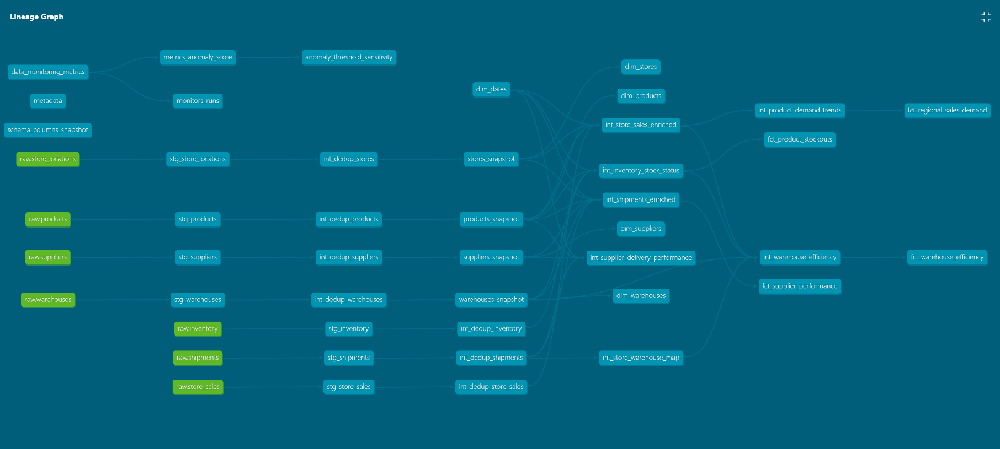

# SupplyChain360 dbt Pipeline Structure

This document details the transformation pipeline that converts fragmented operational data into a unified, reliable, and performance-optimized analytical warehouse.

The project follows a modular architecture to transform raw operational data into high-performance analytical models.

## Architecture Overview
The pipeline is divided into three distinct schemas:

 **1. STAGING (Raw Schema):** Initial cleaning and standardization of source data.

 **2. INTERMEDIATE (Intermediate Schema):** Heavy lifting, deduplication, and complex business logic enrichment.

 **3. MARTS (Analytics Schema):** Final Dimension and Fact tables optimized for BI tools and the AI Genie bot.

## 1. Staging Layer — `STAGING` Schema
Acts as the entry point for dbt, cleaning raw inputs and enforcing basic types. No transformations are performed here; only schema
enforcement, type validation, and addition of metadata are applied to create a source of truth.

Model Name | Source System | Key Responsibility |
| :--- | :--- | :--- |
| `stg_store_locations` | Google Sheets | Standardizes store metadata and regional tags. |
| `stg_products` | AWS S3 | Cleans product master data and unit pricing. |
| `stg_suppliers` | AWS S3 | Validates supplier categorization and origin. |
| `stg_warehouses` | AWS S3 | Standardizes warehouse geographic identifiers. |
| `stg_inventory` | AWS S3 | Formats daily stock levels and reorder thresholds. |
| `stg_shipments` | AWS S3 | Standardizes carrier logs and delivery timestamps. |
| `stg_store_sales` | PostgreSQL | Casts transaction amounts and cleans timestamps. |

## 2. Intermediate Layer — `INTERMEDIATE` Schema
Handles deduplication and joins multiple staging models to create "enriched" entities.

Model Name | Type | Key Responsibility |
| :--- | :--- | :--- |
| `int_dedup_[entity]` | Deduplication | Removes duplicate records from all staging models using `ingestion_timestamp`. |
| `int_store_sales_enriched` | Enrcichment | Joins sales with product and store metadata for a unified view. |
| `int_inventory_stock_status` | Logic | Evaluates current stock against reorder thresholds. |
| `int_supplier_delivery_performance` | Logic | Calculates lead times and delivery delays per supplier. |
| `int_product_demand_trends` | Aggregation | Calculates rolling demand and sales velocity for forecasting. |

## 3. Marts Layer — `ANALYTICS` Schema
The final consumption layer consisting of persistent Dimensions and Facts.

### Dimensions (The "Who/What/Where")

Model Name | Primary Key | Description |
| :--- | :--- | :--- |
| `dim_dates` | `date_sk` | Master calendar with fiscal periods and weekend flags. |
| `dim_products` | `product_sk` | Unified product catalog with brand and category hierarchy. |
| `dim_stores` | `product_sk` | Store master list with regional business groupings. |
| `dim_suppliers` | `supplier_sk` | Supplier directory including contact and category details. |
| `dim_warehouse` | `warehouse_sk` | Warehouse list including location and capacity info. |

### Facts (The "How much/When")

Model Name | Foreign Keys | Description |
| :--- | :--- | :--- |
| `fct_product_stockouts` | `date_sk`, `product_id`, `warehouse_id` | Tracks occurrences where inventory hit zero or threshold. |
| `fct_supplier_performance` | `product_sk` | Measures avg. delivery delay and carrier reliability. |
| `fct_regional_sales_demand` | `date_sk` | Aggregates sales volume by store region and product category. |
| `fct_warehouse_efficiency` | `warehouse_id` | Tracks throughput, dock-to-stock time, and shipping accuracy. |